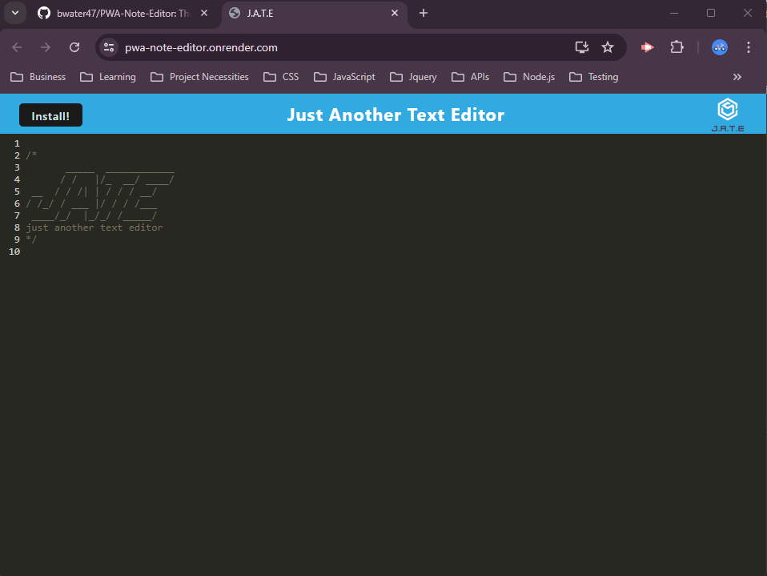

# PWA-Note-Editor

-yellow>)
-lightyellow>)
-purple>)

- An innovative PWA Note Editor that provides an installable, offline-capable solution for taking and managing notes with a user-friendly interface and reliable data caching.

## Description

- My motivation for building this application was to create a simple and reliable tool for taking notes that can be accessed offline. I wanted to enhance productivity by providing a convenient way for users to capture their thoughts and ideas anytime, anywhere, without worrying about internet connectivity.
- This project was built to offer a user-friendly and installable progressive web application for note-taking. It aims to provide a seamless experience for users to create, edit, and organize their notes while ensuring that their data is cached and accessible offline.
- This solves the problem of unreliable access to notes due to internet connectivity issues. By caching the data locally, the PWA Note Editor ensures that users can always access their notes, even when they are offline. It also addresses the need for a straightforward and efficient note-taking application that can be easily installed and used on any device.
- In this project, I learned how to implement a progressive web application that supports offline functionality through caching. I gained experience in using modern web development tools like Webpack and Babel, and I deepened my understanding of service workers and the IndexedDB API for local storage. Additionally, I improved my skills in creating responsive and user-friendly interfaces for web applications.

## Table of Contents (Optional)

Here is a table of contents to make it easy for users to locate which section they need.

- [Installation](#installation)
- [Usage](#usage)
- [Credits](#credits)
- [License](#license)

## Installation

You'll need to install GitBash, VS Code, Node.js, NPM Express, NPM if-env, NPM concurrently, NPM nodemon, NPM @babel/core, NPM @babel/plugin-transform-runtime, NPM @babel/plugin-proposal-object-rest-spread, NPM @babel/preset-env, NPM @babel/runtime, NPM babel-loader, NPM css-loader, NPM html-webpack-plugin, NPM http-server, NPM style-loader, NPM webpack, NPM webpack-cli, NPM webpack-dev-server, NPM webpack-pwa-manifest, NPM workbox-webpack-plugin, NPM code-mirror-themes, NPM idb, and NPM Mongoose. From here you will need knowledge on how to clone a repo from GitHub over to your device to store it locally. Once its stored locally on your device you can open VSCode (IDE). Lastly once VSCode is running, open the CLI (Command-Line-Interface), type npm install for the node_modules packages, npm build to bundle your code using webpack, and then npm start:dev to start of the server and change directories to be in the correct folder. Once you've done this the server will be deployed for local testing, debugging, and developing.

## Usage

The PWA Note Editor is an installable app that lets users take and cache notes for offline access. It offers a simple interface for creating, editing, and organizing notes, making it a convenient tool for capturing ideas anytime, anywhere.

- <strong>PWA Note Editor Link</strong>

- [Website](https://pwa-note-editor.onrender.com/)

- <strong>PWA Note Editor Screenshots</strong>

- 
- 
- 
- 

## Support

N/A

## Credits

People who worked on this project were Brennan Waterbury. You can contact the contributors through the GitHub profiles links listed here.

- <a href="https://github.com/bwater47" alt="GitHub Link">GitHub Profile - Brennan Waterbury</a>

## License

-
- This is an [https://choosealicense.com/licenses/mit/](https://choosealicense.com/licenses/mit/) license.

## Features

<strong>Social Network API</strong>: The Social API Turbo allows developers who are making a social media network to tap into the already built NoSQL database provided by this package.

## Contributing

Contributing is allowed if you're in the U of U Coding Bootcamp. Contact us on the slack channel for information.

- [Contributor Covenant](https://www.contributor-covenant.org/)

## Authors and Acknowledgment

The developer Data Platform. MongoDB. (07/10/24). https://www.mongodb.com/

Getting started. Mongoose v8.4.4: Getting Started. (07/10/24). https://mongoosejs.com/docs/

Handlebars. (07/10/24). https://handlebarsjs.com/

Sequelize V6. Sequelize. (07/10/24). https://sequelize.org/docs/v6/

The Collaborative API Development Platform. Insomnia. (07/10/24). https://insomnia.rest/

Routing. Express routing. (07/10/24). https://expressjs.com/en/guide/routing.html#express-router

NPM docs. npm Docs. (07/10/24). https://docs.npmjs.com/

CLI commands. npm Docs. (07/10/24). https://docs.npmjs.com/cli/v10/commands

Node.js V22.0.0 documentation. Command-line API | Node.js v22.0.0 Documentation. (07/10/24). https://nodejs.org/api/cli.html

MozDevNet. (07/10/24). Resources for developers, by developers. MDN Web Docs. https://developer.mozilla.org/en-US/

Bootcamp Spot. (07/10/24). https://bootcampspot.com/

W3Schools Online Web Tutorials. (07/10/24). https://www.w3schools.com/

Chatgpt. ChatGPT. (07/10/24). https://openai.com/chatgpt

• Please note: While ChatGPT was utilized to generate dialog content for the README file, it was not involved in the generation of any code, HTML edits, CSS edits, or other assets within the repository apart from this README specifically.

• All other sources, links, and information utilized within the project were obtained from the provided sources mentioned in this paragraph. This includes class materials, modules, TA guidance, instructor-provided resources, as well as communication through platforms such as Slack or Discord. Additionally, numerous links and resources were provided within the assignment instructions and demonstrated during class sessions.

## Roadmap

Tests: N/A

## Project status

In-Progress
